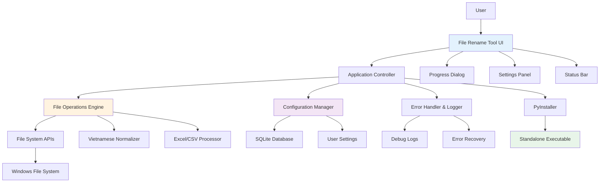
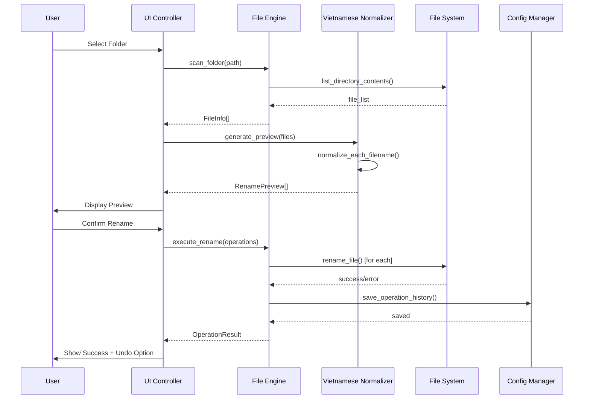
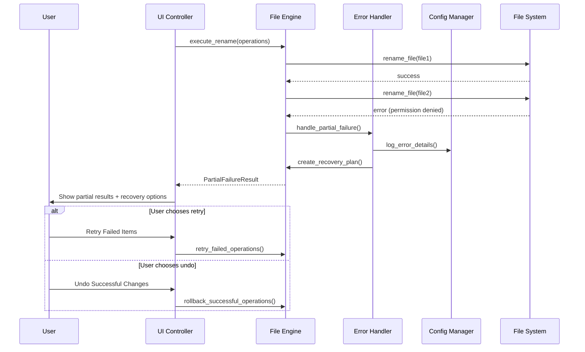
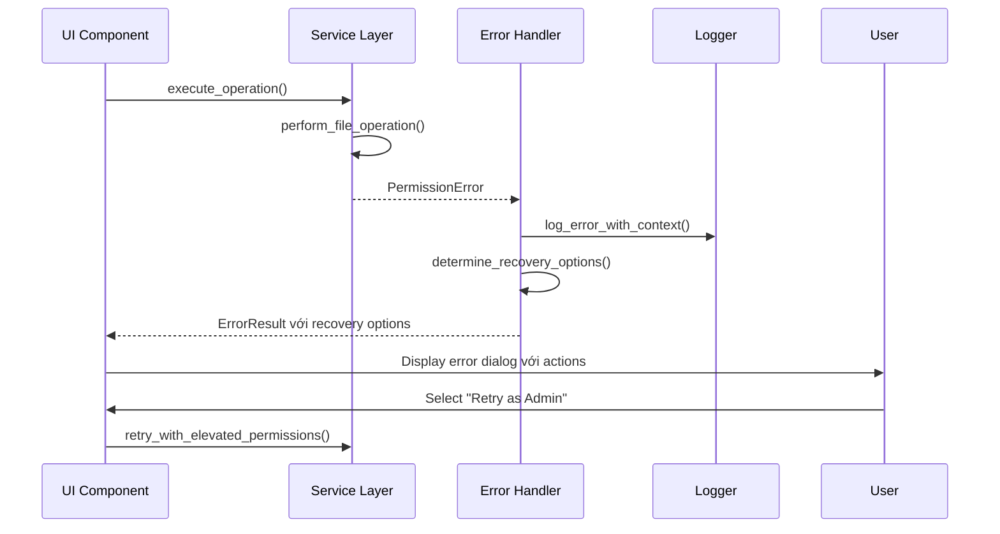

# File Rename Tool Fullstack Architecture Document

## Introduction

This document outlines the complete fullstack architecture for File Rename Tool, including frontend UI architecture, backend file processing systems, and their integration. It serves as the single source of truth for AI-driven development, ensuring consistency across the entire technology stack.

This unified approach adapts traditional fullstack concepts to desktop application context, treating UI layer and file processing engine as integrated but distinct architectural concerns.

### Starter Template or Existing Project

**Status**: Brownfield project with existing Python codebase (`file.py`)

**Existing Implementation Analysis**:
- Complete Tkinter GUI với 4-tab interface (File rename, Excel mapping, Info export, Folder operations)
- Vietnamese text normalization logic với proven algorithms
- Excel/CSV file operations cho advanced mapping scenarios
- Error handling và debug logging infrastructure
- Cross-platform file operations với Windows focus

**Architecture Constraints**:
- Must leverage existing Python business logic
- Preserve proven file operation patterns
- Enhance packaging và distribution approach
- Improve error resilience và user experience
- Maintain backward compatibility với existing workflows

### Change Log
| Date | Version | Description | Author |
|------|---------|-------------|---------|
| 2025-01-30 | v1.0 | Initial full-stack architecture creation | Winston (Architect) |

## High Level Architecture

### Technical Summary

File Rename Tool employs a modular desktop architecture with clear separation between UI presentation layer (Tkinter), business logic engine (file operations), and data persistence layer (configuration + logging). The application leverages PyInstaller packaging để create standalone Windows executable, eliminating Python runtime dependencies. Core integration points include file system APIs, configuration management, và error logging systems. Infrastructure approach focuses on local-first operations với optional cloud backup cho settings. This architecture achieves PRD goals by transforming development-friction Python script into production-ready desktop utility với enterprise-grade error handling và user experience.

### Platform and Infrastructure Choice

**Platform**: Windows Desktop với Local-First Architecture
**Key Services**: 
- Windows File System APIs cho file operations
- Local SQLite database cho settings và operation history
- Windows Registry integration cho application registration
- PyInstaller packaging pipeline cho distribution

**Deployment Host and Regions**: Local desktop installation, no server dependencies

### Repository Structure

**Structure**: Monorepo với modular Python packages
**Monorepo Tool**: Python native packages với setuptools
**Package Organization**: Clear separation giữa UI, business logic, configuration, và packaging components

### High Level Architecture Diagram



### Architectural Patterns

- **Layered Architecture**: Clear separation between UI, business logic, và data persistence layers - _Rationale:_ Enables testing, maintainability, và future enhancements
- **Model-View-Controller (MVC)**: UI components (View), business logic (Model), application controller coordination - _Rationale:_ Familiar pattern cho desktop applications với clear responsibility separation
- **Repository Pattern**: Abstract file operations và configuration access - _Rationale:_ Enables unit testing và future storage mechanism changes
- **Command Pattern**: File operations as executable commands với undo capability - _Rationale:_ Supports undo functionality và operation queuing
- **Observer Pattern**: UI updates responding to operation progress và status changes - _Rationale:_ Decouples UI từ business logic, enables responsive feedback

## Tech Stack

### Technology Stack Table

| Category | Technology | Version | Purpose | Rationale |
|----------|------------|---------|---------|-----------|
| UI Framework | Python Tkinter | 3.11+ | Desktop GUI framework | Native Python library, no additional dependencies, Windows-native feel |
| UI Enhancement | tkinter.ttk | Built-in | Modern UI widgets | Provides Windows 10/11 themed controls |
| Business Logic Language | Python | 3.11+ | Core application logic | Leverage existing codebase, mature ecosystem |
| Text Processing | Unidecode | 1.3+ | Vietnamese normalization | Proven library cho diacritic removal |
| File Operations | Pandas | 2.0+ | Excel/CSV processing | Robust data manipulation, existing integration |
| Excel Integration | OpenPyXL | 3.1+ | Excel file creation/reading | Native Excel format support |
| Database | SQLite | Built-in | Settings và operation history | Lightweight, serverless, Python native |
| Configuration | ConfigParser | Built-in | Application settings management | Standard Python configuration format |
| Logging | Python logging | Built-in | Error tracking và debugging | Comprehensive logging infrastructure |
| Testing Framework | pytest | 7.4+ | Unit và integration testing | Industry standard, comprehensive features |
| UI Testing | pytest-qt | 4.2+ | GUI testing automation | Tkinter testing support |
| Packaging Tool | PyInstaller | 5.13+ | Executable creation | Create standalone Windows executables |
| Build Automation | Make/Batch | System | Build pipeline automation | Simple build process coordination |
| Version Control | Git | 2.40+ | Source code management | Standard version control |
| Code Quality | Black | 23.7+ | Code formatting | Consistent Python code style |
| Code Quality | Flake8 | 6.0+ | Linting và style checking | Code quality enforcement |
| Documentation | Sphinx | 7.1+ | API documentation generation | Professional documentation output |

## Data Models

### Configuration Model

**Purpose**: Store user preferences, application settings, và normalization rules

**Key Attributes**:
- `normalization_rules`: Dict - Vietnamese text processing rules configuration
- `ui_preferences`: Dict - Window size, position, recent folders
- `operation_settings`: Dict - Default behaviors, safety settings

#### TypeScript Interface
```python
@dataclass
class AppConfiguration:
    normalization_rules: Dict[str, bool]
    ui_preferences: Dict[str, Any]
    operation_settings: Dict[str, Any]
    recent_folders: List[str]
    version: str
    last_updated: datetime
```

#### Relationships
- One-to-many với OperationHistory
- Referenced by UserPreferences

### Operation History Model

**Purpose**: Track file rename operations cho audit trail và undo functionality

**Key Attributes**:
- `operation_id`: str - Unique identifier cho each batch operation
- `timestamp`: datetime - When operation occurred
- `folder_path`: str - Target folder location
- `file_mappings`: List - Original và new names cho each file

#### TypeScript Interface
```python
@dataclass
class OperationHistory:
    operation_id: str
    timestamp: datetime
    folder_path: str
    file_mappings: List[FileMappingRecord]
    operation_type: str
    status: str  # success, partial, failed
    error_details: Optional[str]
```

#### Relationships
- Belongs to AppConfiguration
- One-to-many với FileMappingRecord

### File Processing Model

**Purpose**: Represent individual file rename operations với metadata

**Key Attributes**:
- `original_name`: str - File name before processing
- `processed_name`: str - File name after Vietnamese normalization
- `file_path`: str - Full path to file
- `operation_status`: str - Success, failed, skipped

#### TypeScript Interface
```python
@dataclass
class FileProcessingRecord:
    original_name: str
    processed_name: str
    file_path: str
    file_size: int
    operation_status: str
    error_message: Optional[str]
    timestamp: datetime
```

## API Specification

**Note**: Desktop application does not expose external APIs. This section covers internal component interfaces.

### Internal Component APIs

#### File Operations Interface
```python
class FileOperationsEngine:
    def scan_folder(self, folder_path: str) -> List[FileInfo]
    def preview_rename(self, files: List[FileInfo], rules: NormalizationRules) -> List[RenamePreview]
    def execute_rename(self, operations: List[RenameOperation]) -> OperationResult
    def undo_operation(self, operation_id: str) -> UndoResult
```

#### Configuration Manager Interface
```python
class ConfigurationManager:
    def load_settings(self) -> AppConfiguration
    def save_settings(self, config: AppConfiguration) -> bool
    def get_recent_folders(self) -> List[str]
    def add_recent_folder(self, folder_path: str) -> None
```

#### Vietnamese Normalizer Interface
```python
class VietnameseNormalizer:
    def normalize_text(self, text: str) -> str
    def remove_diacritics(self, text: str) -> str
    def clean_special_chars(self, text: str) -> str
    def apply_case_rules(self, text: str) -> str
```

## Components

### UI Controller Component
**Responsibility**: Coordinate between user interface và business logic, handle user interactions và application state

**Key Interfaces**:
- `handle_folder_selection()` - Process folder browse events
- `update_preview_display()` - Refresh file preview list
- `execute_rename_operation()` - Trigger batch rename với progress feedback

**Dependencies**: FileOperationsEngine, ConfigurationManager, ErrorHandler

**Technology Stack**: Python Tkinter với custom event handling patterns

### File Operations Engine
**Responsibility**: Core business logic cho file scanning, preview generation, và batch rename execution

**Key Interfaces**:
- `scan_folder_contents()` - Analyze folder và extract file information
- `generate_rename_preview()` - Create before/after preview với Vietnamese normalization
- `execute_batch_rename()` - Perform actual file system operations với error handling

**Dependencies**: VietnameseNormalizer, FileSystemAPIs, ErrorHandler

**Technology Stack**: Python os/pathlib libraries với custom file operation wrappers

### Configuration Manager
**Responsibility**: Persistent storage và retrieval của user preferences, application settings

**Key Interfaces**:
- `load_user_preferences()` - Initialize application với saved settings
- `save_configuration_changes()` - Persist user modifications to disk
- `manage_recent_folders()` - Track và provide quick access to frequently used locations

**Dependencies**: SQLite database, FileSystem access

**Technology Stack**: Python ConfigParser với SQLite backend cho structured data

### Vietnamese Text Processor
**Responsibility**: Specialized text normalization cho Vietnamese language files

**Key Interfaces**:
- `normalize_vietnamese_text()` - Apply diacritic removal và standardization rules
- `clean_file_name()` - Remove unsafe characters từ file names
- `apply_custom_rules()` - Process user-defined text transformation patterns

**Dependencies**: Unidecode library, custom Vietnamese character mappings

**Technology Stack**: Python string processing với Unicode normalization libraries

## External APIs

**Status**: No external API integrations required - File Rename Tool operates entirely locally with file system APIs only.

## Core Workflows

### Primary Rename Workflow



### Error Recovery Workflow



## Database Schema

### SQLite Schema Design

```sql
-- Application Configuration
CREATE TABLE app_config (
    id INTEGER PRIMARY KEY,
    key TEXT UNIQUE NOT NULL,
    value TEXT NOT NULL,
    data_type TEXT NOT NULL, -- 'string', 'json', 'boolean', 'integer'
    last_updated DATETIME DEFAULT CURRENT_TIMESTAMP
);

-- Operation History
CREATE TABLE operation_history (
    operation_id TEXT PRIMARY KEY,
    timestamp DATETIME DEFAULT CURRENT_TIMESTAMP,
    folder_path TEXT NOT NULL,
    operation_type TEXT NOT NULL, -- 'batch_rename', 'undo'
    total_files INTEGER NOT NULL,
    successful_files INTEGER NOT NULL,
    failed_files INTEGER NOT NULL,
    status TEXT NOT NULL, -- 'success', 'partial', 'failed'
    error_summary TEXT
);

-- Individual File Operations
CREATE TABLE file_operations (
    id INTEGER PRIMARY KEY AUTOINCREMENT,
    operation_id TEXT NOT NULL,
    original_name TEXT NOT NULL,
    new_name TEXT NOT NULL,
    file_path TEXT NOT NULL,
    file_size INTEGER,
    status TEXT NOT NULL, -- 'success', 'failed', 'skipped'
    error_message TEXT,
    timestamp DATETIME DEFAULT CURRENT_TIMESTAMP,
    FOREIGN KEY (operation_id) REFERENCES operation_history(operation_id)
);

-- Recent Folders
CREATE TABLE recent_folders (
    id INTEGER PRIMARY KEY AUTOINCREMENT,
    folder_path TEXT UNIQUE NOT NULL,
    last_accessed DATETIME DEFAULT CURRENT_TIMESTAMP,
    access_count INTEGER DEFAULT 1
);

-- Create indexes for performance
CREATE INDEX idx_operation_history_timestamp ON operation_history(timestamp);
CREATE INDEX idx_file_operations_operation_id ON file_operations(operation_id);
CREATE INDEX idx_recent_folders_last_accessed ON recent_folders(last_accessed);
```

## Frontend Architecture

### Component Architecture

#### Component Organization
```
src/
├── ui/
│   ├── main_window.py          # Primary application window
│   ├── components/
│   │   ├── folder_selector.py  # Folder browsing widget
│   │   ├── file_preview.py     # Before/after file list
│   │   ├── progress_dialog.py  # Operation progress modal
│   │   ├── settings_panel.py   # Configuration interface
│   │   └── status_bar.py       # Status và help information
│   ├── dialogs/
│   │   ├── error_dialog.py     # Error display và recovery
│   │   ├── confirm_dialog.py   # Operation confirmation
│   │   └── about_dialog.py     # Application information
│   └── styles/
│       ├── themes.py           # Windows 10/11 styling
│       └── constants.py        # UI constants và colors
```

#### Component Template
```python
from tkinter import ttk
from typing import Protocol, Callable
from dataclasses import dataclass

class UIComponent(Protocol):
    def initialize(self, parent: ttk.Widget) -> None: ...
    def update_data(self, data: Any) -> None: ...
    def get_user_input(self) -> Any: ...
    def handle_error(self, error: Exception) -> None: ...

@dataclass
class ComponentState:
    is_loading: bool = False
    has_error: bool = False
    error_message: str = ""
    data: Any = None

class BaseComponent:
    def __init__(self, parent: ttk.Widget, state_changed_callback: Callable):
        self.parent = parent
        self.state = ComponentState()
        self.on_state_changed = state_changed_callback
        self.setup_ui()
    
    def setup_ui(self) -> None:
        """Override trong subclasses để create UI elements"""
        pass
    
    def update_state(self, **kwargs) -> None:
        """Update component state và trigger re-render"""
        for key, value in kwargs.items():
            if hasattr(self.state, key):
                setattr(self.state, key, value)
        self.render()
        self.on_state_changed(self.state)
```

### State Management Architecture

#### State Structure
```python
from dataclasses import dataclass, field
from typing import List, Optional, Dict, Any
from enum import Enum

class AppState(Enum):
    IDLE = "idle"
    LOADING = "loading"
    PREVIEW = "preview"
    EXECUTING = "executing"
    ERROR = "error"

@dataclass
class ApplicationState:
    # UI State
    current_state: AppState = AppState.IDLE
    selected_folder: Optional[str] = None
    files_preview: List[Dict] = field(default_factory=list)
    
    # Operation State  
    current_operation_id: Optional[str] = None
    progress_percentage: float = 0.0
    current_file_being_processed: Optional[str] = None
    
    # Settings State
    normalization_rules: Dict[str, bool] = field(default_factory=dict)
    ui_preferences: Dict[str, Any] = field(default_factory=dict)
    
    # Error State
    last_error: Optional[Exception] = None
    error_recovery_options: List[str] = field(default_factory=list)

class StateManager:
    def __init__(self):
        self.state = ApplicationState()
        self.subscribers: List[Callable] = []
    
    def subscribe(self, callback: Callable) -> None:
        self.subscribers.append(callback)
    
    def update_state(self, **kwargs) -> None:
        for key, value in kwargs.items():
            if hasattr(self.state, key):
                setattr(self.state, key, value)
        self._notify_subscribers()
    
    def _notify_subscribers(self) -> None:
        for callback in self.subscribers:
            callback(self.state)
```

#### State Management Patterns
- **Centralized State**: Single ApplicationState object managed by StateManager
- **Observer Pattern**: Components subscribe to state changes
- **Immutable Updates**: State changes through dedicated update methods
- **Error Boundaries**: Error state isolated và recoverable

## Backend Architecture

### Service Architecture

#### Traditional Server Architecture

##### Controller/Route Organization
```
src/
├── core/
│   ├── application.py          # Main application controller
│   ├── services/
│   │   ├── file_service.py     # File operations business logic
│   │   ├── config_service.py   # Configuration management
│   │   ├── history_service.py  # Operation history tracking
│   │   └── normalize_service.py # Vietnamese text processing
│   ├── repositories/
│   │   ├── config_repository.py # Configuration persistence
│   │   ├── history_repository.py # History data access
│   │   └── file_repository.py   # File system abstractions
│   ├── models/
│   │   ├── file_info.py        # File metadata models
│   │   ├── operation.py        # Operation tracking models
│   │   └── config.py           # Configuration models
│   └── utils/
│       ├── error_handler.py    # Error management utilities
│       ├── logger.py           # Logging infrastructure
│       └── validators.py       # Input validation helpers
```

##### Controller Template
```python
from typing import List, Optional
from dataclasses import dataclass
from core.services.file_service import FileService
from core.services.config_service import ConfigService
from core.models.operation import RenameOperation, OperationResult

class ApplicationController:
    def __init__(self):
        self.file_service = FileService()
        self.config_service = ConfigService()
        self.current_operation: Optional[str] = None
    
    async def scan_folder(self, folder_path: str) -> List[FileInfo]:
        """Scan folder và return file information"""
        try:
            self.config_service.add_recent_folder(folder_path)
            return await self.file_service.scan_directory(folder_path)
        except Exception as e:
            self._handle_error("FOLDER_SCAN_ERROR", e)
            raise
    
    async def preview_rename_operations(
        self, 
        files: List[FileInfo], 
        rules: NormalizationRules
    ) -> List[RenamePreview]:
        """Generate preview của rename operations"""
        try:
            return await self.file_service.generate_preview(files, rules)
        except Exception as e:
            self._handle_error("PREVIEW_GENERATION_ERROR", e)
            raise
    
    async def execute_rename_batch(
        self, 
        operations: List[RenameOperation],
        progress_callback: Callable[[float, str], None]
    ) -> OperationResult:
        """Execute batch rename với progress updates"""
        operation_id = self.file_service.create_operation_id()
        self.current_operation = operation_id
        
        try:
            result = await self.file_service.execute_batch_rename(
                operations, 
                progress_callback
            )
            await self.config_service.save_operation_history(operation_id, result)
            return result
        except Exception as e:
            await self._handle_operation_error(operation_id, e)
            raise
        finally:
            self.current_operation = None
```

### Database Architecture

#### Schema Design
```sql
-- Enhanced schema với performance optimizations
CREATE TABLE app_config (
    id INTEGER PRIMARY KEY,
    key TEXT UNIQUE NOT NULL,
    value TEXT NOT NULL,
    data_type TEXT NOT NULL CHECK (data_type IN ('string', 'json', 'boolean', 'integer')),
    created_at DATETIME DEFAULT CURRENT_TIMESTAMP,
    updated_at DATETIME DEFAULT CURRENT_TIMESTAMP
);

CREATE TRIGGER update_app_config_timestamp 
AFTER UPDATE ON app_config
BEGIN
    UPDATE app_config SET updated_at = CURRENT_TIMESTAMP WHERE id = NEW.id;
END;
```

#### Data Access Layer
```python
from contextlib import asynccontextmanager
from typing import List, Optional, Dict, Any
import sqlite3
import json
from core.models.config import AppConfiguration

class ConfigRepository:
    def __init__(self, db_path: str):
        self.db_path = db_path
        self._initialize_database()
    
    @asynccontextmanager
    async def get_connection(self):
        conn = sqlite3.connect(self.db_path)
        conn.row_factory = sqlite3.Row
        try:
            yield conn
        finally:
            conn.close()
    
    async def load_configuration(self) -> AppConfiguration:
        """Load complete application configuration"""
        async with self.get_connection() as conn:
            cursor = conn.cursor()
            cursor.execute("SELECT key, value, data_type FROM app_config")
            
            config_data = {}
            for row in cursor.fetchall():
                key, value, data_type = row
                if data_type == 'json':
                    config_data[key] = json.loads(value)
                elif data_type == 'boolean':
                    config_data[key] = value.lower() == 'true'
                elif data_type == 'integer':
                    config_data[key] = int(value)
                else:
                    config_data[key] = value
            
            return AppConfiguration(**config_data)
    
    async def save_configuration(self, config: AppConfiguration) -> None:
        """Persist configuration changes"""
        async with self.get_connection() as conn:
            cursor = conn.cursor()
            
            for key, value in config.__dict__.items():
                if isinstance(value, (dict, list)):
                    data_type, serialized = 'json', json.dumps(value)
                elif isinstance(value, bool):
                    data_type, serialized = 'boolean', str(value)
                elif isinstance(value, int):
                    data_type, serialized = 'integer', str(value)
                else:
                    data_type, serialized = 'string', str(value)
                
                cursor.execute("""
                    INSERT OR REPLACE INTO app_config (key, value, data_type)
                    VALUES (?, ?, ?)
                """, (key, serialized, data_type))
            
            conn.commit()
```

## Unified Project Structure

```
file-rename-tool/
├── .github/                    # CI/CD workflows  
│   └── workflows/
│       ├── build.yml           # Build và test automation
│       └── release.yml         # Release packaging workflow
├── src/                        # Application source code
│   ├── main.py                 # Application entry point
│   ├── ui/                     # User interface layer
│   │   ├── __init__.py
│   │   ├── main_window.py      # Primary application window
│   │   ├── components/         # Reusable UI components
│   │   │   ├── __init__.py
│   │   │   ├── folder_selector.py
│   │   │   ├── file_preview.py
│   │   │   ├── progress_dialog.py
│   │   │   ├── settings_panel.py
│   │   │   └── status_bar.py
│   │   ├── dialogs/           # Modal dialogs
│   │   │   ├── __init__.py
│   │   │   ├── error_dialog.py
│   │   │   ├── confirm_dialog.py
│   │   │   └── about_dialog.py
│   │   └── styles/            # UI styling và theming
│   │       ├── __init__.py
│   │       ├── themes.py
│   │       └── constants.py
│   ├── core/                  # Business logic layer
│   │   ├── __init__.py
│   │   ├── application.py     # Main application controller
│   │   ├── services/          # Business services
│   │   │   ├── __init__.py
│   │   │   ├── file_service.py
│   │   │   ├── config_service.py
│   │   │   ├── history_service.py
│   │   │   └── normalize_service.py
│   │   ├── repositories/      # Data access layer
│   │   │   ├── __init__.py
│   │   │   ├── config_repository.py
│   │   │   ├── history_repository.py
│   │   │   └── file_repository.py
│   │   ├── models/            # Data models
│   │   │   ├── __init__.py
│   │   │   ├── file_info.py
│   │   │   ├── operation.py
│   │   │   └── config.py
│   │   └── utils/             # Utility functions
│   │       ├── __init__.py
│   │       ├── error_handler.py
│   │       ├── logger.py
│   │       └── validators.py
│   └── resources/             # Static resources
│       ├── icons/             # Application icons
│       ├── styles/            # CSS/styling resources
│       └── config/            # Default configuration files
├── tests/                     # Test suites
│   ├── __init__.py
│   ├── unit/                  # Unit tests
│   │   ├── test_file_service.py
│   │   ├── test_normalize_service.py
│   │   └── test_config_service.py
│   ├── integration/           # Integration tests
│   │   ├── test_file_operations.py
│   │   └── test_ui_workflows.py
│   └── fixtures/              # Test data và fixtures
│       ├── sample_files/
│       └── test_configs/
├── packaging/                 # Distribution và packaging
│   ├── build.py              # PyInstaller build script
│   ├── installer.nsi         # NSIS installer script (optional)
│   ├── requirements.txt      # Python dependencies
│   └── version.py            # Version management
├── docs/                     # Documentation
│   ├── prd.md
│   ├── front-end-spec.md
│   ├── architecture.md
│   ├── user-guide.md
│   └── developer-guide.md
├── scripts/                  # Build và utility scripts
│   ├── build.bat            # Windows build script
│   ├── test.bat             # Test execution script
│   └── clean.bat            # Cleanup script
├── .env.example             # Environment variables template
├── requirements.txt         # Python dependencies
├── setup.py                 # Package setup configuration
├── pyproject.toml           # Modern Python project configuration
├── Makefile                 # Build automation (cross-platform)
└── README.md                # Project documentation
```

## Development Workflow

### Local Development Setup

#### Prerequisites
```bash
# Install Python 3.11+ với pip
python --version  # Should be 3.11+
pip --version

# Install system dependencies (Windows)
# No additional system dependencies required
```

#### Initial Setup
```bash
# Clone repository và setup environment
git clone <repository-url>
cd file-rename-tool

# Create virtual environment
python -m venv venv
venv\Scripts\activate  # Windows
# source venv/bin/activate  # macOS/Linux

# Install dependencies
pip install -r requirements.txt
pip install -e .  # Install package in development mode

# Initialize database
python scripts/init_database.py

# Run initial tests
python -m pytest tests/
```

#### Development Commands
```bash
# Start application in development mode
python src/main.py

# Run specific tests
python -m pytest tests/unit/
python -m pytest tests/integration/

# Code quality checks
black src/ tests/        # Format code
flake8 src/ tests/       # Lint code
mypy src/               # Type checking

# Build distribution
python packaging/build.py

# Clean build artifacts
python scripts/clean.py
```

### Environment Configuration

#### Required Environment Variables
```bash
# Application (.env)
APP_NAME=File Rename Tool
APP_VERSION=1.0.0
DEBUG_MODE=True
LOG_LEVEL=INFO

# Database
DATABASE_PATH=data/app.db

# Logging
LOG_FILE_PATH=logs/app.log
MAX_LOG_SIZE_MB=10
LOG_RETENTION_DAYS=30

# UI Settings
WINDOW_WIDTH=800
WINDOW_HEIGHT=600
THEME=windows10

# Development
ENABLE_DEBUG_MENU=True
MOCK_FILE_OPERATIONS=False
```

## Deployment Architecture

### Deployment Strategy

**Application Packaging**:
- **Platform**: PyInstaller executable generation
- **Build Command**: `python packaging/build.py --onefile`
- **Output Directory**: `dist/`
- **Distribution Method**: Direct download, optional Windows installer

**Executable Distribution**:
- **Primary**: Standalone .exe file (~50MB)
- **Secondary**: MSI installer package (optional)
- **Update Mechanism**: Manual download và replacement
- **Installation**: Copy-to-run hoặc installer-based

### CI/CD Pipeline
```yaml
name: Build and Release
on:
  push:
    branches: [main]
    tags: [v*]
  pull_request:
    branches: [main]

jobs:
  test:
    runs-on: windows-latest
    steps:
      - uses: actions/checkout@v3
      - uses: actions/setup-python@v4
        with:
          python-version: '3.11'
      
      - name: Install dependencies
        run: |
          pip install -r requirements.txt
          pip install -e .
      
      - name: Run tests
        run: python -m pytest tests/ --cov=src/
      
      - name: Code quality checks
        run: |
          black --check src/ tests/
          flake8 src/ tests/
          mypy src/

  build:
    needs: test
    runs-on: windows-latest
    if: startsWith(github.ref, 'refs/tags/')
    
    steps:
      - uses: actions/checkout@v3
      - uses: actions/setup-python@v4
        with:
          python-version: '3.11'
      
      - name: Install dependencies
        run: |
          pip install -r requirements.txt
          pip install pyinstaller
      
      - name: Build executable
        run: python packaging/build.py --release
      
      - name: Create installer (optional)
        run: makensis packaging/installer.nsi
      
      - name: Upload artifacts
        uses: actions/upload-artifact@v3
        with:
          name: file-rename-tool-${{ github.ref_name }}
          path: dist/
```

### Environments
| Environment | Purpose | Distribution Method |
|-------------|---------|-------------------|
| Development | Local development và testing | Direct Python execution |
| Staging | Pre-release testing | Beta executable distribution |
| Production | End user release | Official executable + installer |

## Security and Performance

### Security Requirements

**Application Security**:
- **Input Validation**: Sanitize all user inputs, validate file paths
- **File System Safety**: Prevent directory traversal, validate write permissions
- **Configuration Security**: Encrypt sensitive settings, secure config file access

**Error Information Disclosure**:
- **Debug Information**: Disable debug output trong production builds
- **Error Messages**: Generic error messages to users, detailed logging internally
- **File Path Exposure**: Avoid exposing internal system paths trong UI

**Executable Security**:
- **Code Signing**: Sign executable với valid certificate (future)
- **Antivirus Compatibility**: Structure code để avoid false positive detection
- **Permission Model**: Request minimal Windows permissions required

### Performance Optimization

**Application Performance**:
- **Startup Time**: Target < 2 seconds cold start
- **File Processing**: Async processing cho large directories (1000+ files)
- **Memory Management**: Efficient file list handling, streaming for large operations

**UI Responsiveness**:
- **Threading**: Background processing cho file operations
- **Progress Updates**: Real-time feedback during batch operations
- **Lazy Loading**: Load file information on-demand

**Database Performance**:
- **Query Optimization**: Indexed lookups cho recent folders và history
- **Data Retention**: Automatic cleanup của old operation logs
- **Backup Strategy**: Periodic configuration backup to prevent data loss

## Testing Strategy

### Testing Pyramid
```
        E2E Tests (UI Automation)
       /                        \
  Integration Tests (File Ops + UI)
 /                                    \
Unit Tests (Services + Utils)  Component Tests (UI)
```

### Test Organization

#### Unit Tests
```
tests/unit/
├── test_file_service.py        # File operations business logic
├── test_normalize_service.py   # Vietnamese text processing
├── test_config_service.py      # Configuration management
├── test_history_service.py     # Operation history tracking
├── test_repositories.py        # Data access layer
└── test_utils.py              # Utility functions
```

#### Integration Tests
```
tests/integration/
├── test_file_operations_flow.py    # End-to-end file operations
├── test_ui_file_interaction.py     # UI + file system integration
├── test_database_operations.py     # Database + service integration
└── test_error_recovery_flow.py     # Error handling workflows
```

#### E2E Tests
```
tests/e2e/
├── test_complete_rename_workflow.py   # Full user journey testing
├── test_settings_management.py        # Configuration UI flows
├── test_error_scenarios.py            # Error handling user experience
└── test_undo_operations.py           # Undo functionality workflows
```

### Test Examples

#### Frontend Component Test
```python
import pytest
from tkinter import Tk
from unittest.mock import Mock, patch
from src.ui.components.file_preview import FilePreviewComponent
from src.core.models.file_info import FileInfo, RenamePreview

class TestFilePreviewComponent:
    @pytest.fixture
    def root_window(self):
        root = Tk()
        yield root
        root.destroy()
    
    @pytest.fixture
    def mock_state_callback(self):
        return Mock()
    
    def test_file_preview_display(self, root_window, mock_state_callback):
        # Arrange
        component = FilePreviewComponent(root_window, mock_state_callback)
        preview_data = [
            RenamePreview(
                original="Nguễn ĐINH qucs# File.txt",
                processed="nguen dinh qucs file.txt",
                status="ready"
            )
        ]
        
        # Act
        component.update_data(preview_data)
        
        # Assert
        tree_widget = component.preview_tree
        children = tree_widget.get_children()
        assert len(children) == 1
        
        item_values = tree_widget.item(children[0])['values']
        assert item_values[0] == "Nguễn ĐINH qucs# File.txt"
        assert item_values[1] == "nguen dinh qucs file.txt"
        assert item_values[2] == "ready"
    
    def test_conflict_highlighting(self, root_window, mock_state_callback):
        # Test duplicate name conflict detection
        component = FilePreviewComponent(root_window, mock_state_callback)
        preview_data = [
            RenamePreview(
                original="File (1).txt",
                processed="file.txt", 
                status="conflict"
            ),
            RenamePreview(
                original="File (2).txt",
                processed="file.txt",
                status="conflict"
            )
        ]
        
        component.update_data(preview_data)
        
        # Verify conflict highlighting
        tree_widget = component.preview_tree
        for child in tree_widget.get_children():
            tags = tree_widget.item(child)['tags']
            assert 'conflict' in tags
```

#### Backend API Test
```python
import pytest
import tempfile
import os
from pathlib import Path
from src.core.services.file_service import FileService
from src.core.models.file_info import FileInfo
from src.core.models.operation import NormalizationRules

class TestFileService:
    @pytest.fixture
    async def file_service(self):
        return FileService()
    
    @pytest.fixture
    def temp_directory(self):
        with tempfile.TemporaryDirectory() as temp_dir:
            # Create test files với Vietnamese names
            test_files = [
                "Nguễn Văn A.txt",
                "Tài liệu (QUAN TRỌNG).docx", 
                "File#test*special.pdf"
            ]
            
            for filename in test_files:
                Path(temp_dir) / filename).touch()
            
            yield temp_dir
    
    @pytest.mark.asyncio
    async def test_scan_directory(self, file_service, temp_directory):
        # Act
        files = await file_service.scan_directory(temp_directory)
        
        # Assert
        assert len(files) == 3
        assert all(isinstance(f, FileInfo) for f in files)
        
        filenames = [f.name for f in files]
        assert "Nguễn Văn A.txt" in filenames
        assert "Tài liệu (QUAN TRỌNG).docx" in filenames
        assert "File#test*special.pdf" in filenames
    
    @pytest.mark.asyncio
    async def test_vietnamese_normalization_preview(
        self, 
        file_service, 
        temp_directory
    ):
        # Arrange
        files = await file_service.scan_directory(temp_directory)
        rules = NormalizationRules(
            remove_diacritics=True,
            lowercase=True,
            clean_special_chars=True
        )
        
        # Act
        previews = await file_service.generate_preview(files, rules)
        
        # Assert
        assert len(previews) == 3
        
        # Check specific transformations
        preview_map = {p.original: p.processed for p in previews}
        assert preview_map["Nguễn Văn A.txt"] == "nguyen van a.txt"
        assert preview_map["Tài liệu (QUAN TRỌNG).docx"] == "tai lieu quan trong.docx"
        assert preview_map["File#test*special.pdf"] == "file test special.pdf"
    
    @pytest.mark.asyncio
    async def test_batch_rename_execution(
        self,
        file_service,
        temp_directory
    ):
        # Arrange
        files = await file_service.scan_directory(temp_directory)
        rules = NormalizationRules(remove_diacritics=True, lowercase=True)
        previews = await file_service.generate_preview(files, rules)
        
        progress_updates = []
        def progress_callback(percent: float, current_file: str):
            progress_updates.append((percent, current_file))
        
        # Act
        result = await file_service.execute_batch_rename(
            previews,
            progress_callback
        )
        
        # Assert
        assert result.success_count == 3
        assert result.error_count == 0
        assert len(progress_updates) >= 3  # At least one update per file
        
        # Verify files were actually renamed
        actual_files = os.listdir(temp_directory)
        assert "nguyen van a.txt" in actual_files
        assert "tai lieu quan trong.docx" in actual_files
```

#### E2E Test
```python
import pytest
import tempfile
import os
from pathlib import Path
import tkinter as tk
from unittest.mock import patch
from src.main import FileRenameApplication

class TestCompleteRenameWorkflow:
    @pytest.fixture
    def temp_directory_with_files(self):
        with tempfile.TemporaryDirectory() as temp_dir:
            # Create realistic test scenario
            test_files = [
                "Báo cáo tháng 12 (FINAL).docx",
                "Hình ảnh đẹp nhất năm 2024!.jpg",
                "Tài liệu_quan#trọng***.pdf"
            ]
            
            for filename in test_files:
                (Path(temp_dir) / filename).touch()
            
            yield temp_dir
    
    @pytest.mark.asyncio
    async def test_complete_rename_workflow(
        self, 
        temp_directory_with_files
    ):
        """Test complete user workflow from folder selection to rename completion"""
        
        # Initialize application
        app = FileRenameApplication()
        await app.initialize()
        
        try:
            # Step 1: Select folder
            await app.select_folder(temp_directory_with_files)
            assert app.state.selected_folder == temp_directory_with_files
            assert len(app.state.files_preview) == 3
            
            # Step 2: Verify preview generation
            preview_files = app.state.files_preview
            original_names = [f['original'] for f in preview_files]
            processed_names = [f['processed'] for f in preview_files]
            
            assert "Báo cáo tháng 12 (FINAL).docx" in original_names
            assert "bao cao thang 12 final.docx" in processed_names
            
            # Step 3: Execute rename operation
            progress_updates = []
            
            def track_progress(percent, current_file):
                progress_updates.append((percent, current_file))
            
            result = await app.execute_rename_operation(
                progress_callback=track_progress
            )
            
            # Verify operation success
            assert result.success_count == 3
            assert result.error_count == 0
            assert len(progress_updates) >= 3
            
            # Step 4: Verify files were actually renamed on disk
            actual_files = os.listdir(temp_directory_with_files)
            assert "bao cao thang 12 final.docx" in actual_files
            assert "hinh anh dep nhat nam 2024.jpg" in actual_files
            assert "tai lieu quan trong.pdf" in actual_files
            
            # Step 5: Test undo functionality
            undo_result = await app.undo_last_operation()
            assert undo_result.success
            
            # Verify original files restored
            restored_files = os.listdir(temp_directory_with_files)
            assert "Báo cáo tháng 12 (FINAL).docx" in restored_files
            assert "Hình ảnh đẹp nhất năm 2024!.jpg" in restored_files
            assert "Tài liệu_quan#trọng***.pdf" in restored_files
            
        finally:
            await app.cleanup()
    
    @pytest.mark.asyncio
    async def test_error_recovery_workflow(
        self,
        temp_directory_with_files
    ):
        """Test error handling và recovery when some files fail to rename"""
        
        app = FileRenameApplication()
        await app.initialize()
        
        try:
            await app.select_folder(temp_directory_with_files)
            
            # Simulate file lock by opening one file
            locked_file_path = Path(temp_directory_with_files) / "Báo cáo tháng 12 (FINAL).docx"
            with open(locked_file_path, 'r') as locked_file:
                
                # Attempt rename operation
                result = await app.execute_rename_operation()
                
                # Verify partial success handling
                assert result.success_count == 2  # 2 files renamed successfully
                assert result.error_count == 1    # 1 file failed (locked)
                
                # Verify error details available
                assert len(result.error_details) == 1
                assert "permission" in result.error_details[0].lower()
                
                # Test recovery options presented to user
                recovery_options = app.get_recovery_options()
                assert "retry_failed" in recovery_options
                assert "undo_successful" in recovery_options
            
            # After file is released, test retry functionality
            retry_result = await app.retry_failed_operations()
            assert retry_result.success_count == 1
            assert retry_result.error_count == 0
            
        finally:
            await app.cleanup()
```

## Coding Standards

### Critical Fullstack Rules

- **Error Handling Consistency**: All file operations must use the centralized ErrorHandler với standardized error codes và recovery options
- **Configuration Management**: Access settings only through ConfigService, never direct file/registry access
- **UI State Synchronization**: All UI updates must go through StateManager để maintain consistency across components
- **File Operation Safety**: Always create backup/undo information before destructive operations, validate paths before processing
- **Threading Discipline**: Long-running operations must execute on background threads với proper progress callbacks
- **Resource Management**: Always use context managers cho file operations, database connections, và UI resources
- **Logging Standards**: Use structured logging với operation IDs, include enough context for debugging
- **Input Validation**: Validate all user inputs at service layer boundaries, sanitize file paths và names

### Naming Conventions

| Element | Convention | Example |
|---------|------------|---------|
| Classes | PascalCase | `FileOperationsService`, `ConfigurationManager` |
| Functions/Methods | snake_case | `scan_directory()`, `execute_rename_operation()` |
| Variables | snake_case | `selected_folder`, `operation_result` |
| Constants | UPPER_SNAKE_CASE | `MAX_FILE_NAME_LENGTH`, `DEFAULT_TIMEOUT` |
| Files | snake_case.py | `file_service.py`, `main_window.py` |
| UI Components | PascalCase | `FilePreviewComponent`, `ProgressDialog` |

## Error Handling Strategy

### Error Flow



### Error Response Format
```python
from dataclasses import dataclass
from typing import Optional, Dict, Any, List
from datetime import datetime
from enum import Enum

class ErrorCode(Enum):
    PERMISSION_DENIED = "PERMISSION_DENIED"
    FILE_NOT_FOUND = "FILE_NOT_FOUND"
    FILE_IN_USE = "FILE_IN_USE"
    DISK_FULL = "DISK_FULL"
    INVALID_PATH = "INVALID_PATH"
    OPERATION_CANCELLED = "OPERATION_CANCELLED"
    UNKNOWN_ERROR = "UNKNOWN_ERROR"

@dataclass
class ApplicationError:
    code: ErrorCode
    message: str
    details: Dict[str, Any]
    timestamp: datetime
    operation_id: Optional[str] = None
    file_path: Optional[str] = None
    recovery_suggestions: List[str] = None
    
    def to_user_message(self) -> str:
        """Convert technical error to user-friendly message"""
        user_messages = {
            ErrorCode.PERMISSION_DENIED: "Access denied. Try running as administrator.",
            ErrorCode.FILE_NOT_FOUND: "File not found. It may have been moved or deleted.",
            ErrorCode.FILE_IN_USE: "File is currently open in another program. Please close it and try again.",
            ErrorCode.DISK_FULL: "Not enough disk space to complete the operation.",
            ErrorCode.INVALID_PATH: "Invalid file path. Please check the location.",
            ErrorCode.OPERATION_CANCELLED: "Operation was cancelled by user.",
            ErrorCode.UNKNOWN_ERROR: "An unexpected error occurred. Please try again."
        }
        return user_messages.get(self.code, self.message)
```

### Frontend Error Handling
```python
from typing import Callable, Optional
import tkinter as tk
from tkinter import messagebox
import logging

class UIErrorHandler:
    def __init__(self, parent_window: tk.Tk):
        self.parent = parent_window
        self.logger = logging.getLogger(__name__)
        
    def handle_error(
        self, 
        error: ApplicationError, 
        retry_callback: Optional[Callable] = None
    ) -> None:
        """Handle error với appropriate UI response"""
        
        # Log error details
        self.logger.error(
            f"Error {error.code.value}: {error.message}",
            extra={
                'operation_id': error.operation_id,
                'file_path': error.file_path,
                'details': error.details
            }
        )
        
        # Determine dialog type based on error severity
        if error.code in [ErrorCode.PERMISSION_DENIED, ErrorCode.FILE_IN_USE]:
            self._show_recoverable_error_dialog(error, retry_callback)
        elif error.code == ErrorCode.OPERATION_CANCELLED:
            # Silent handling cho user-initiated cancellation
            pass
        else:
            self._show_error_dialog(error)
    
    def _show_recoverable_error_dialog(
        self, 
        error: ApplicationError, 
        retry_callback: Optional[Callable]
    ) -> None:
        """Show error dialog với recovery options"""
        
        result = messagebox.askyesnocancel(
            title="Operation Error",
            message=f"{error.to_user_message()}\n\nWould you like to retry?",
            detail=f"Error details: {error.details.get('system_message', 'N/A')}"
        )
        
        if result is True and retry_callback:
            try:
                retry_callback()
            except Exception as retry_error:
                self.logger.exception("Retry operation failed")
                messagebox.showerror(
                    title="Retry Failed",
                    message="The retry operation also failed. Please check the error log."
                )
        elif result is None:
            # User cancelled, do nothing
            pass
    
    def _show_error_dialog(self, error: ApplicationError) -> None:
        """Show simple error notification"""
        messagebox.showerror(
            title="Error",
            message=error.to_user_message(),
            detail=f"Time: {error.timestamp.strftime('%Y-%m-%d %H:%M:%S')}\nOperation: {error.operation_id or 'N/A'}"
        )
```

### Backend Error Handling
```python
import logging
from contextlib import contextmanager
from typing import Generator, Any
import traceback

class ServiceErrorHandler:
    def __init__(self):
        self.logger = logging.getLogger(__name__)
        
    @contextmanager
    def handle_service_errors(
        self, 
        operation_name: str, 
        operation_id: str = None
    ) -> Generator[None, None, None]:
        """Context manager cho service-level error handling"""
        
        try:
            self.logger.info(f"Starting operation: {operation_name}", extra={
                'operation_id': operation_id,
                'operation_name': operation_name
            })
            
            yield
            
            self.logger.info(f"Completed operation: {operation_name}", extra={
                'operation_id': operation_id,
                'operation_name': operation_name
            })
            
        except PermissionError as e:
            error = ApplicationError(
                code=ErrorCode.PERMISSION_DENIED,
                message=str(e),
                details={
                    'operation_name': operation_name,
                    'system_message': str(e),
                    'traceback': traceback.format_exc()
                },
                timestamp=datetime.now(),
                operation_id=operation_id,
                recovery_suggestions=[
                    "Run application as administrator",
                    "Check file permissions",
                    "Ensure file is not read-only"
                ]
            )
            self.logger.error(f"Permission error trong {operation_name}", exc_info=True, extra={
                'operation_id': operation_id,
                'error_code': error.code.value
            })
            raise error
            
        except FileNotFoundError as e:
            error = ApplicationError(
                code=ErrorCode.FILE_NOT_FOUND,
                message=str(e),
                details={
                    'operation_name': operation_name,
                    'system_message': str(e)
                },
                timestamp=datetime.now(),
                operation_id=operation_id,
                recovery_suggestions=[
                    "Refresh folder contents",
                    "Check if file was moved",
                    "Verify folder path is correct"
                ]
            )
            self.logger.error(f"File not found trong {operation_name}", exc_info=True)
            raise error
            
        except Exception as e:
            # Generic error handling
            error = ApplicationError(
                code=ErrorCode.UNKNOWN_ERROR,
                message=f"Unexpected error trong {operation_name}: {str(e)}",
                details={
                    'operation_name': operation_name,
                    'exception_type': type(e).__name__,
                    'system_message': str(e),
                    'traceback': traceback.format_exc()
                },
                timestamp=datetime.now(),
                operation_id=operation_id
            )
            self.logger.exception(f"Unexpected error trong {operation_name}", extra={
                'operation_id': operation_id,
                'exception_type': type(e).__name__
            })
            raise error

# Usage example trong service class
class FileService:
    def __init__(self):
        self.error_handler = ServiceErrorHandler()
    
    async def execute_batch_rename(
        self, 
        operations: List[RenameOperation]
    ) -> OperationResult:
        operation_id = self.generate_operation_id()
        
        with self.error_handler.handle_service_errors(
            operation_name="batch_rename",
            operation_id=operation_id
        ):
            results = []
            for operation in operations:
                try:
                    os.rename(operation.old_path, operation.new_path)
                    results.append(OperationSuccess(operation))
                except Exception as e:
                    # Let context manager handle the error
                    raise
            
            return OperationResult(success_count=len(results), operations=results)
```

## Monitoring and Observability

### Monitoring Stack
- **Application Monitoring**: Python logging với structured JSON output
- **Performance Monitoring**: Custom performance counters cho file operations
- **Error Tracking**: Local error logging với optional cloud reporting
- **User Analytics**: Usage pattern tracking (local only, privacy-focused)

### Key Metrics

**Application Metrics:**
- Startup time và memory usage
- File operation success/failure rates
- User workflow completion rates
- Error frequency và types

**Performance Metrics:**
- File scanning performance (files per second)
- Rename operation throughput
- UI responsiveness (event processing time)
- Database query performance

## Checklist Results Report

*To be populated after running architect checklist validation*