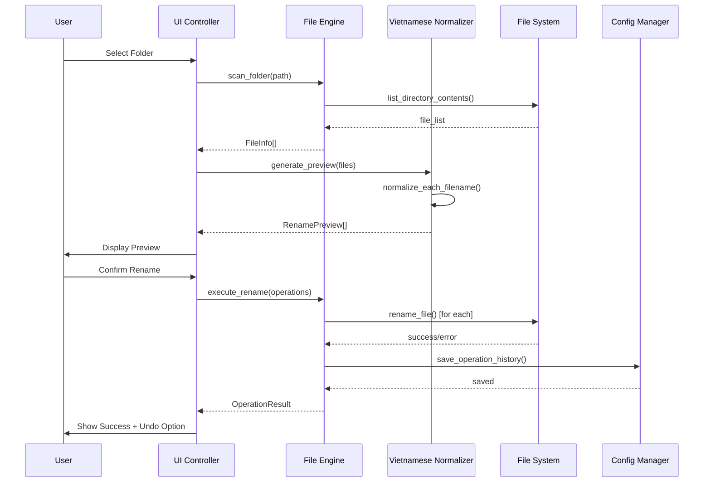
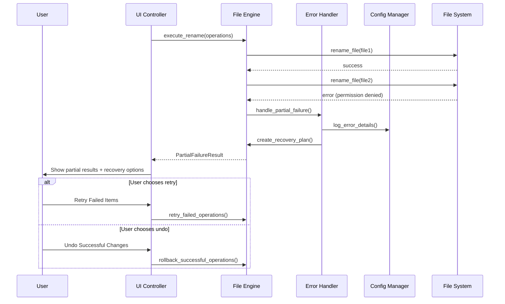

# Core Workflows

## Primary Rename Workflow

```mermaid
sequenceDiagram
    participant U as User
    participant UI as UI Controller
    participant FE as File Engine
    participant VN as Vietnamese Normalizer
    participant FS as File System
    participant CM as Config Manager
    
    U->>UI: Select Folder
    UI->>FE: scan_folder(path)
    FE->>FS: list_directory_contents()
    FS-->>FE: file_list
    FE-->>UI: FileInfo[]
    
    UI->>VN: generate_preview(files)
    VN->>VN: normalize_each_filename()
    VN-->>UI: RenamePreview[]
    UI->>U: Display Preview
    
    U->>UI: Confirm Rename
    UI->>FE: execute_rename(operations)
    FE->>FS: rename_file() [for each]
    FS-->>FE: success/error
    FE->>CM: save_operation_history()
    CM-->>FE: saved
    FE-->>UI: OperationResult
    UI->>U: Show Success + Undo Option
```

## Error Recovery Workflow

```mermaid
sequenceDiagram
    participant U as User
    participant UI as UI Controller
    participant FE as File Engine
    participant EH as Error Handler
    participant CM as Config Manager
    participant FS as File System
    
    UI->>FE: execute_rename(operations)
    FE->>FS: rename_file(file1)
    FS-->>FE: success
    FE->>FS: rename_file(file2)
    FS-->>FE: error (permission denied)
    FE->>EH: handle_partial_failure()
    EH->>CM: log_error_details()
    EH->>FE: create_recovery_plan()
    FE-->>UI: PartialFailureResult
    UI->>U: Show partial results + recovery options
    
    alt User chooses retry
        U->>UI: Retry Failed Items
        UI->>FE: retry_failed_operations()
    else User chooses undo
        U->>UI: Undo Successful Changes
        UI->>FE: rollback_successful_operations()
    end
```
