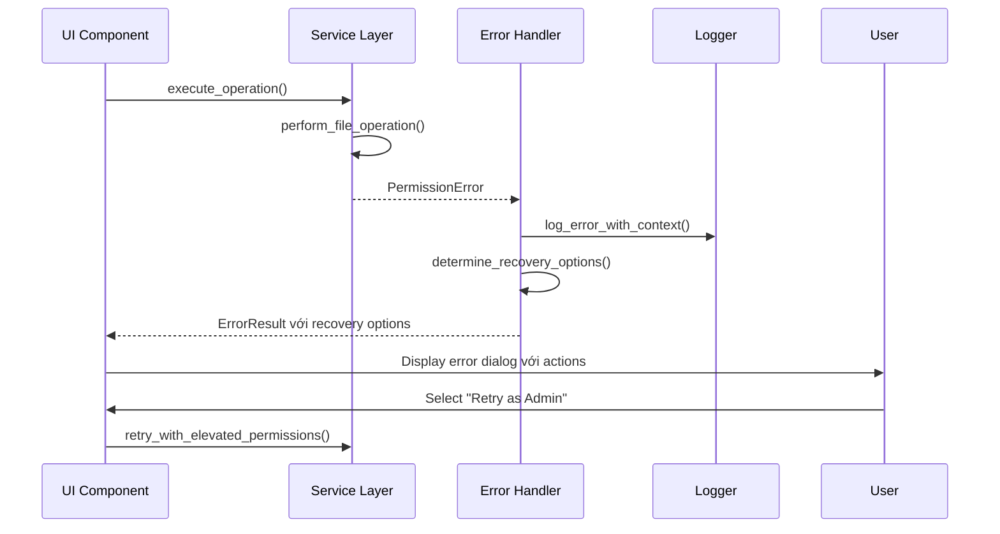

# Error Handling Strategy

## Error Flow



## Error Response Format
```python
from dataclasses import dataclass
from typing import Optional, Dict, Any, List
from datetime import datetime
from enum import Enum

class ErrorCode(Enum):
    PERMISSION_DENIED = "PERMISSION_DENIED"
    FILE_NOT_FOUND = "FILE_NOT_FOUND"
    FILE_IN_USE = "FILE_IN_USE"
    DISK_FULL = "DISK_FULL"
    INVALID_PATH = "INVALID_PATH"
    OPERATION_CANCELLED = "OPERATION_CANCELLED"
    UNKNOWN_ERROR = "UNKNOWN_ERROR"

@dataclass
class ApplicationError:
    code: ErrorCode
    message: str
    details: Dict[str, Any]
    timestamp: datetime
    operation_id: Optional[str] = None
    file_path: Optional[str] = None
    recovery_suggestions: List[str] = None
    
    def to_user_message(self) -> str:
        """Convert technical error to user-friendly message"""
        user_messages = {
            ErrorCode.PERMISSION_DENIED: "Access denied. Try running as administrator.",
            ErrorCode.FILE_NOT_FOUND: "File not found. It may have been moved or deleted.",
            ErrorCode.FILE_IN_USE: "File is currently open in another program. Please close it and try again.",
            ErrorCode.DISK_FULL: "Not enough disk space to complete the operation.",
            ErrorCode.INVALID_PATH: "Invalid file path. Please check the location.",
            ErrorCode.OPERATION_CANCELLED: "Operation was cancelled by user.",
            ErrorCode.UNKNOWN_ERROR: "An unexpected error occurred. Please try again."
        }
        return user_messages.get(self.code, self.message)
```

## Frontend Error Handling
```python
from typing import Callable, Optional
import tkinter as tk
from tkinter import messagebox
import logging

class UIErrorHandler:
    def __init__(self, parent_window: tk.Tk):
        self.parent = parent_window
        self.logger = logging.getLogger(__name__)
        
    def handle_error(
        self, 
        error: ApplicationError, 
        retry_callback: Optional[Callable] = None
    ) -> None:
        """Handle error với appropriate UI response"""
        
        # Log error details
        self.logger.error(
            f"Error {error.code.value}: {error.message}",
            extra={
                'operation_id': error.operation_id,
                'file_path': error.file_path,
                'details': error.details
            }
        )
        
        # Determine dialog type based on error severity
        if error.code in [ErrorCode.PERMISSION_DENIED, ErrorCode.FILE_IN_USE]:
            self._show_recoverable_error_dialog(error, retry_callback)
        elif error.code == ErrorCode.OPERATION_CANCELLED:
            # Silent handling cho user-initiated cancellation
            pass
        else:
            self._show_error_dialog(error)
    
    def _show_recoverable_error_dialog(
        self, 
        error: ApplicationError, 
        retry_callback: Optional[Callable]
    ) -> None:
        """Show error dialog với recovery options"""
        
        result = messagebox.askyesnocancel(
            title="Operation Error",
            message=f"{error.to_user_message()}\n\nWould you like to retry?",
            detail=f"Error details: {error.details.get('system_message', 'N/A')}"
        )
        
        if result is True and retry_callback:
            try:
                retry_callback()
            except Exception as retry_error:
                self.logger.exception("Retry operation failed")
                messagebox.showerror(
                    title="Retry Failed",
                    message="The retry operation also failed. Please check the error log."
                )
        elif result is None:
            # User cancelled, do nothing
            pass
    
    def _show_error_dialog(self, error: ApplicationError) -> None:
        """Show simple error notification"""
        messagebox.showerror(
            title="Error",
            message=error.to_user_message(),
            detail=f"Time: {error.timestamp.strftime('%Y-%m-%d %H:%M:%S')}\nOperation: {error.operation_id or 'N/A'}"
        )
```

## Backend Error Handling
```python
import logging
from contextlib import contextmanager
from typing import Generator, Any
import traceback

class ServiceErrorHandler:
    def __init__(self):
        self.logger = logging.getLogger(__name__)
        
    @contextmanager
    def handle_service_errors(
        self, 
        operation_name: str, 
        operation_id: str = None
    ) -> Generator[None, None, None]:
        """Context manager cho service-level error handling"""
        
        try:
            self.logger.info(f"Starting operation: {operation_name}", extra={
                'operation_id': operation_id,
                'operation_name': operation_name
            })
            
            yield
            
            self.logger.info(f"Completed operation: {operation_name}", extra={
                'operation_id': operation_id,
                'operation_name': operation_name
            })
            
        except PermissionError as e:
            error = ApplicationError(
                code=ErrorCode.PERMISSION_DENIED,
                message=str(e),
                details={
                    'operation_name': operation_name,
                    'system_message': str(e),
                    'traceback': traceback.format_exc()
                },
                timestamp=datetime.now(),
                operation_id=operation_id,
                recovery_suggestions=[
                    "Run application as administrator",
                    "Check file permissions",
                    "Ensure file is not read-only"
                ]
            )
            self.logger.error(f"Permission error trong {operation_name}", exc_info=True, extra={
                'operation_id': operation_id,
                'error_code': error.code.value
            })
            raise error
            
        except FileNotFoundError as e:
            error = ApplicationError(
                code=ErrorCode.FILE_NOT_FOUND,
                message=str(e),
                details={
                    'operation_name': operation_name,
                    'system_message': str(e)
                },
                timestamp=datetime.now(),
                operation_id=operation_id,
                recovery_suggestions=[
                    "Refresh folder contents",
                    "Check if file was moved",
                    "Verify folder path is correct"
                ]
            )
            self.logger.error(f"File not found trong {operation_name}", exc_info=True)
            raise error
            
        except Exception as e:
            # Generic error handling
            error = ApplicationError(
                code=ErrorCode.UNKNOWN_ERROR,
                message=f"Unexpected error trong {operation_name}: {str(e)}",
                details={
                    'operation_name': operation_name,
                    'exception_type': type(e).__name__,
                    'system_message': str(e),
                    'traceback': traceback.format_exc()
                },
                timestamp=datetime.now(),
                operation_id=operation_id
            )
            self.logger.exception(f"Unexpected error trong {operation_name}", extra={
                'operation_id': operation_id,
                'exception_type': type(e).__name__
            })
            raise error
