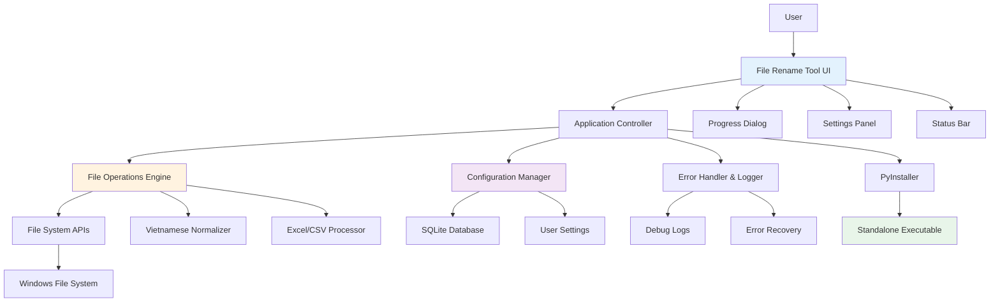

# High Level Architecture

## Technical Summary

File Rename Tool employs a modular desktop architecture with clear separation between UI presentation layer (Tkinter), business logic engine (file operations), and data persistence layer (configuration + logging). The application leverages PyInstaller packaging để create standalone Windows executable, eliminating Python runtime dependencies. Core integration points include file system APIs, configuration management, và error logging systems. Infrastructure approach focuses on local-first operations với optional cloud backup cho settings. This architecture achieves PRD goals by transforming development-friction Python script into production-ready desktop utility với enterprise-grade error handling và user experience.

## Platform and Infrastructure Choice

**Platform**: Windows Desktop với Local-First Architecture
**Key Services**: 
- Windows File System APIs cho file operations
- Local SQLite database cho settings và operation history
- Windows Registry integration cho application registration
- PyInstaller packaging pipeline cho distribution

**Deployment Host and Regions**: Local desktop installation, no server dependencies

## Repository Structure

**Structure**: Monorepo với modular Python packages
**Monorepo Tool**: Python native packages với setuptools
**Package Organization**: Clear separation giữa UI, business logic, configuration, và packaging components

## High Level Architecture Diagram

## Architectural Patterns

- **Layered Architecture**: Clear separation between UI, business logic, và data persistence layers - _Rationale:_ Enables testing, maintainability, và future enhancements
- **Model-View-Controller (MVC)**: UI components (View), business logic (Model), application controller coordination - _Rationale:_ Familiar pattern cho desktop applications với clear responsibility separation
- **Repository Pattern**: Abstract file operations và configuration access - _Rationale:_ Enables unit testing và future storage mechanism changes
- **Command Pattern**: File operations as executable commands với undo capability - _Rationale:_ Supports undo functionality và operation queuing
- **Observer Pattern**: UI updates responding to operation progress và status changes - _Rationale:_ Decouples UI từ business logic, enables responsive feedback
