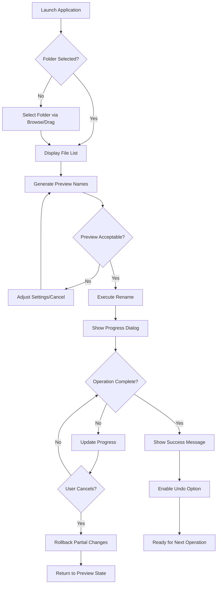
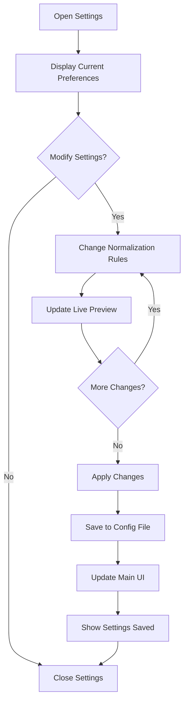

# File Rename Tool UI/UX Specification

## Introduction

This document defines the user experience goals, information architecture, user flows, and visual design specifications for File Rename Tool's user interface. It serves as the foundation for visual design and frontend development, ensuring a cohesive and user-centered experience.

### Overall UX Goals & Principles

#### Target User Personas
- **Efficiency-Focused Professional**: Knowledge workers 25-45 tuổi cần organize files nhanh chóng, minimize workflow disruption, prioritize speed và reliability over advanced features
- **Safety-Conscious Team Manager**: Team leads quản lý shared folders, cần preview capabilities và undo functionality để avoid costly mistakes, value audit trail và error prevention

#### Usability Goals
- **Zero learning curve**: Users familiar với Windows Explorer có thể sử dụng ngay lập tức without tutorial
- **2-click efficiency**: Core rename workflow hoàn thành trong maximum 2 clicks (Browse → Execute)
- **Mistake prevention**: 100% operations có preview step, clear visual feedback cho destructive actions
- **Interruption recovery**: Application state preserved nếu bị interrupted, undo available for last 1 operation

#### Design Principles
1. **Safety first, speed second**: Every destructive action preceded by clear preview và confirmation
2. **Windows-native feel**: Leverage familiar UI patterns từ File Explorer và standard Windows apps
3. **Progressive disclosure**: Show essential controls first, advanced options accessible but not prominent
4. **Immediate visual feedback**: Every interaction provides instant response, loading states visible
5. **Error-resilient design**: Graceful degradation, clear recovery paths, never leave users stranded

### Change Log
| Date | Version | Description | Author |
|------|---------|-------------|---------|
| 2025-01-30 | v1.0 | Initial UI/UX specification creation | Chị Lan (UX Expert) |

## Information Architecture (IA)

### Site Map / Screen Inventory

```mermaid
graph TD
    A[Main Application Window] --> B[Folder Selection Area]
    A --> C[File Preview List]
    A --> D[Action Controls]
    
    B --> B1[Browse Button]
    B --> B2[Folder Path Display]
    B --> B3[Drag-Drop Zone]
    
    C --> C1[Original Names Column]
    C --> C2[New Names Preview Column]
    C --> C3[Status Indicators]
    C --> C4[Individual File Toggle]
    
    D --> D1[Preview/Refresh Button]
    D --> D2[Execute Rename Button]
    D --> D3[Undo Last Operation]
    
    A --> E[Progress Dialog]
    E --> E1[Progress Bar]
    E --> E2[Current File Indicator]
    E --> E3[Cancel Button]
    E --> E4[Time Remaining]
    
    A --> F[Settings Panel]
    F --> F1[Normalization Rules]
    F --> F2[Application Preferences]
    F --> F3[Recent Folders]
    
    A --> G[Status Bar]
    G --> G1[Selected Files Count]
    G --> G2[Operation Status]
    G --> G3[Quick Help Tips]
```



### Navigation Structure

**Primary Navigation**: Single-window desktop application với tabbed interface pattern
- **Main Tab**: Core rename functionality (default view)  
- **Settings Tab**: Configuration options (accessible via menu hoặc dedicated button)
- **Help Tab**: Quick reference và troubleshooting (F1 key hoặc Help menu)

**Secondary Navigation**: Context-sensitive controls within each view
- **File list**: Right-click context menu cho individual file actions
- **Folder area**: Recent folders dropdown cho quick access
- **Preview area**: Column sorting và filtering options

**Breadcrumb Strategy**: Folder path breadcrumb trong folder selection area, showing current location với clickable parent directories for quick navigation up folder hierarchy

## User Flows

### Core Batch Rename Flow

**User Goal**: Apply Vietnamese normalization to multiple files safely và efficiently

**Entry Points**: Application startup, drag-drop folder, recent folders menu

**Success Criteria**: Files renamed with preview verification, undo option available

#### Flow Diagram



#### Edge Cases & Error Handling:
- **Folder access denied**: Show clear permission error với suggestion to run as administrator
- **Files in use**: Identify locked files, allow partial operation on available files
- **Duplicate names**: Highlight conflicts trong preview, suggest resolution strategies
- **Operation cancellation**: Clean rollback to last consistent state, clear progress indication
- **System interruption**: Auto-save operation state, resume capability on next launch

**Notes**: Flow emphasizes preview step as mandatory gate before execution, provides multiple exit points for safety

### Settings Configuration Flow

**User Goal**: Customize normalization rules và application behavior

**Entry Points**: Settings menu, first-run setup, gear icon trong main window

**Success Criteria**: Preferences saved và immediately applied to preview

#### Flow Diagram



#### Edge Cases & Error Handling:
- **Config file corruption**: Reset to defaults với user confirmation
- **Invalid rule combinations**: Validate và highlight conflicts before save
- **Permission issues**: Graceful fallback to temporary settings session-only

## Wireframes & Mockups

### Primary Design Files
**Design Tool**: Internal ASCII wireframes với future Figma integration planned

### Key Screen Layouts

#### Main Application Window
**Purpose**: Central workspace cho file rename operations

**Key Elements**:
- **Folder Selection Bar**: Browse button, path display, recent folders dropdown
- **File Preview List**: Two-column layout showing original → new names
- **Action Controls**: Preview refresh, execute rename, undo buttons
- **Status Information**: Selected file count, operation feedback, help tips

**Interaction Notes**: Drag-drop support cho entire window, keyboard shortcuts cho common actions, context menus cho advanced options

**Layout Structure**:
```
┌─────────────────────────────────────────────────────────────────┐
│ File Rename Tool                                    [_] [□] [×] │
├─────────────────────────────────────────────────────────────────┤
│ Folder: [C:\Users\Name\Documents\...    ] [Browse] [▼Recent]    │
├─────────────────────────────────────────────────────────────────┤
│ ┌─────────────────────────────────────────────────────────────┐ │
│ │ Original Name            │ New Name                │ Status │ │
│ ├──────────────────────────┼─────────────────────────┼────────┤ │
│ │ Nguễn ĐINH qucs# File.txt│ nguen dinh qucs file.txt│ ✓      │ │
│ │ Project (FINAL) v2!.docx │ project final v2.docx   │ ✓      │ │
│ │ Important-Data***.xlsx   │ important data.xlsx     │ ✓      │ │
│ └─────────────────────────────────────────────────────────────┘ │
├─────────────────────────────────────────────────────────────────┤
│ [Refresh Preview] [Execute Rename] [Undo] [Settings]            │
├─────────────────────────────────────────────────────────────────┤
│ 124 files selected │ Ready                      │ F1 for Help  │
└─────────────────────────────────────────────────────────────────┘
```

#### Progress Dialog
**Purpose**: Real-time feedback during batch operations với cancellation option

**Key Elements**:
- **Progress Bar**: Visual completion percentage
- **Current File**: Name của file being processed
- **Statistics**: Files completed, remaining, errors encountered
- **Cancel Button**: Stop operation với rollback confirmation

**Interaction Notes**: Modal overlay blocking main window, ESC key cancellation, estimated time remaining

#### Settings Panel
**Purpose**: Configuration cho normalization rules và application preferences

**Key Elements**:
- **Normalization Options**: Toggle diacritics removal, case conversion, special chars
- **Advanced Rules**: Custom replacement patterns, exclusion filters
- **Application Settings**: Window preferences, recent folder history, auto-backup

**Interaction Notes**: Live preview updates khi settings change, reset to defaults option, import/export configurations

## Component Library / Design System

### Design System Approach
**Windows Fluent Design System** adaptation với custom components cho file operations. Use native Windows controls where possible, custom components chỉ khi necessary cho specific functionality.

### Core Components

#### File List Component
**Purpose**: Display original và preview names trong sortable, filterable table format

**Variants**: 
- Standard view: Two-column original/preview layout
- Compact view: Single line với inline preview
- Detail view: Additional metadata columns (size, date modified)

**States**: 
- Empty (no files loaded)
- Loading (scanning folder) 
- Populated (files displayed)
- Error (access denied, invalid folder)

**Usage Guidelines**: Always show preview before execution, support keyboard navigation, provide clear conflict indicators

#### Action Button Set
**Purpose**: Primary controls cho rename workflow execution

**Variants**:
- Execute button: Primary action, enabled only when valid preview available
- Undo button: Secondary action, enabled only after successful operation
- Settings button: Tertiary action, always accessible

**States**: Enabled, disabled, loading, success feedback

**Usage Guidelines**: Follow Windows button conventions, provide tooltips cho complex actions, consistent spacing và alignment

#### Progress Indicator
**Purpose**: Long-running operation feedback với cancellation capability

**Variants**: 
- Determinate progress (known file count)
- Indeterminate progress (scanning phase)
- Error state (partial failure recovery)

**States**: Active, paused, cancelled, completed, error

**Usage Guidelines**: Always allow cancellation, provide meaningful status text, show estimated completion time when possible

## Branding & Style Guide

### Visual Identity
**Brand Guidelines**: Minimal branding approach focusing on functionality. Consistent với Windows 10/11 native applications.

### Color Palette
| Color Type | Hex Code | Usage |
|------------|----------|--------|
| Primary | #0078D4 | Windows accent color, action buttons, links |
| Secondary | #6B6B6B | Secondary text, inactive states |
| Accent | #107C10 | Success states, positive feedback |
| Success | #107C10 | Successful operations, confirmations |
| Warning | #FF8C00 | Cautions, non-blocking issues |
| Error | #D13438 | Errors, destructive actions, conflicts |
| Neutral | #323130, #FAFAFA | Text, borders, backgrounds |

### Typography

#### Font Families
- **Primary**: Segoe UI (Windows system font)
- **Secondary**: Segoe UI Semibold (headings)
- **Monospace**: Consolas (file paths, technical text)

#### Type Scale
| Element | Size | Weight | Line Height |
|---------|------|---------|-------------|
| H1 | 24px | Semibold | 32px |
| H2 | 20px | Semibold | 28px |
| H3 | 16px | Semibold | 22px |
| Body | 14px | Regular | 20px |
| Small | 12px | Regular | 16px |

### Iconography
**Icon Library**: Fluent UI System Icons hoặc Segoe MDL2 Assets

**Usage Guidelines**: 16px standard size, 20px cho primary actions, consistent stroke width, monochrome với accent color on hover

### Spacing & Layout
**Grid System**: 8px base unit grid system aligned với Windows design standards

**Spacing Scale**: 4px, 8px, 16px, 24px, 32px intervals cho consistent visual rhythm

## Accessibility Requirements

### Compliance Target
**Standard**: WCAG 2.1 AA compliance cho essential functionality, progressive enhancement cho AAA where feasible

### Key Requirements

**Visual**:
- Color contrast ratios: 4.5:1 minimum cho normal text, 3:1 cho large text
- Focus indicators: 2px solid outline với high contrast color
- Text sizing: Support up to 200% zoom without horizontal scrolling

**Interaction**:
- Keyboard navigation: Full functionality accessible via keyboard, logical tab order
- Screen reader support: ARIA labels, semantic HTML structure, status announcements
- Touch targets: Minimum 44x44px touch targets cho interactive elements

**Content**:
- Alternative text: Descriptive alt text cho all informative images
- Heading structure: Logical heading hierarchy H1→H2→H3
- Form labels: Explicit labels associated với all form inputs

### Testing Strategy
Automated testing với axe-core, manual testing với NVDA screen reader, keyboard-only navigation testing, high contrast mode validation

## Responsiveness Strategy

### Breakpoints
| Breakpoint | Min Width | Max Width | Target Devices |
|------------|-----------|-----------|----------------|
| Desktop | 1024px | - | Desktop monitors, laptops |

**Note**: Desktop-only application, no mobile hoặc tablet responsive requirements per PRD specifications.

### Adaptation Patterns

**Layout Changes**: Fixed window size với user-resizable capability, minimum 800x600 support

**Navigation Changes**: N/A - single window desktop application

**Content Priority**: All content visible simultaneously, no responsive hiding

**Interaction Changes**: Full mouse và keyboard support at all window sizes

## Animation & Micro-interactions

### Motion Principles
Subtle animations để provide feedback và guide attention. Follow Windows animation guidelines: fast duration (200-300ms), eased transitions, purposeful movement only.

### Key Animations
- **Button Hover**: Subtle background color transition (200ms, ease-out)
- **Progress Update**: Smooth progress bar animation (100ms, linear)
- **Error Highlight**: Gentle shake animation để draw attention to conflicts (300ms, ease-in-out)
- **Success Feedback**: Brief scale animation on successful operations (200ms, ease-out)
- **Loading States**: Subtle spinner animation cho scanning/processing (500ms loop, linear)

## Performance Considerations

### Performance Goals
- **Application Launch**: < 2 seconds to fully loaded state
- **File List Population**: < 1 second cho 1000 files
- **Preview Generation**: < 500ms cho typical folder (50-100 files)
- **UI Responsiveness**: < 100ms response to user interactions

### Design Strategies
- **Progressive Loading**: Show folder structure first, populate preview names asynchronously
- **Virtualization**: Only render visible file list items cho large directories
- **Debounced Updates**: Batch preview regeneration khi settings change
- **Minimal Redraws**: Update only changed elements, maintain efficient render cycles

## Next Steps

### Immediate Actions
1. **Stakeholder Review**: Present specification to development team để technical feasibility validation
2. **Visual Design Creation**: Create high-fidelity mockups trong design tool based on specifications
3. **Prototype Development**: Build interactive prototype cho user testing và validation
4. **Component Architecture Planning**: Work với Front-end Architect để define component structure

### Design Handoff Checklist
- [x] All user flows documented
- [x] Component inventory complete
- [x] Accessibility requirements defined
- [x] Responsive strategy clear (desktop-only confirmed)
- [x] Brand guidelines incorporated
- [x] Performance goals established
- [ ] High-fidelity mockups created
- [ ] Interactive prototype validated
- [ ] Technical implementation review completed